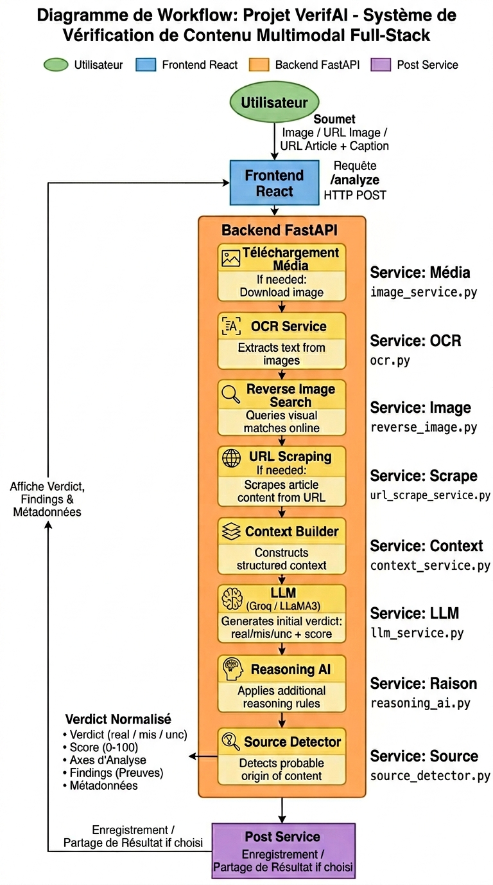
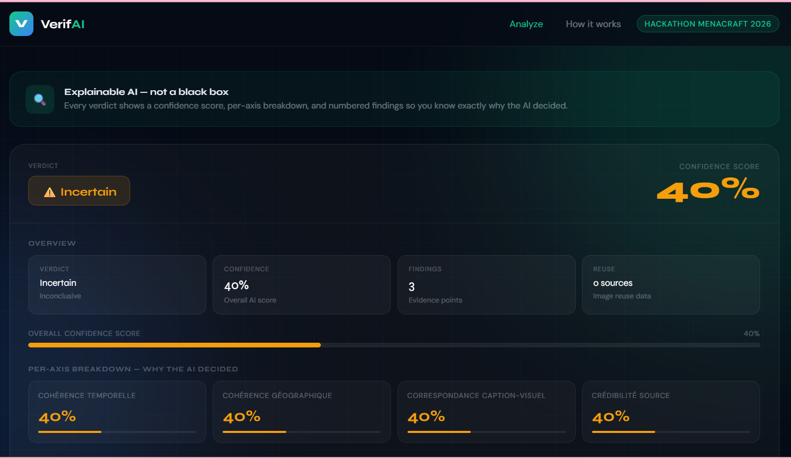
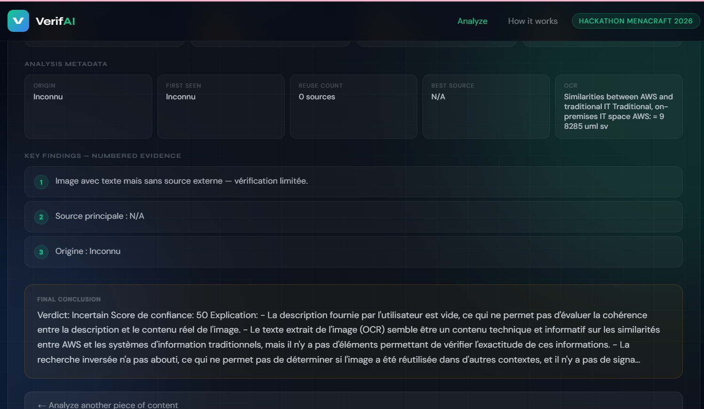
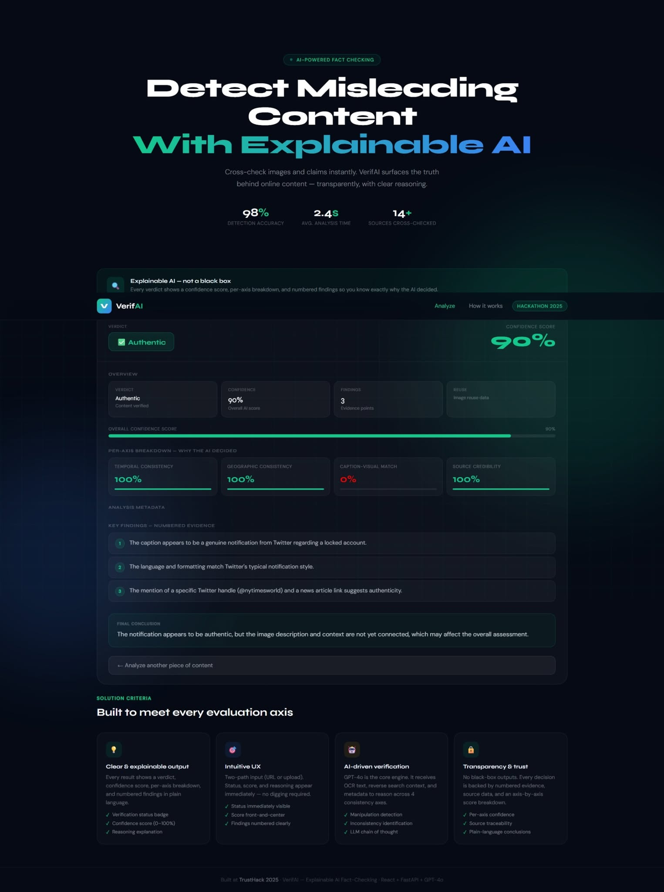
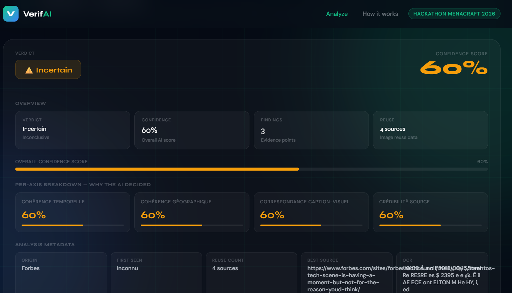
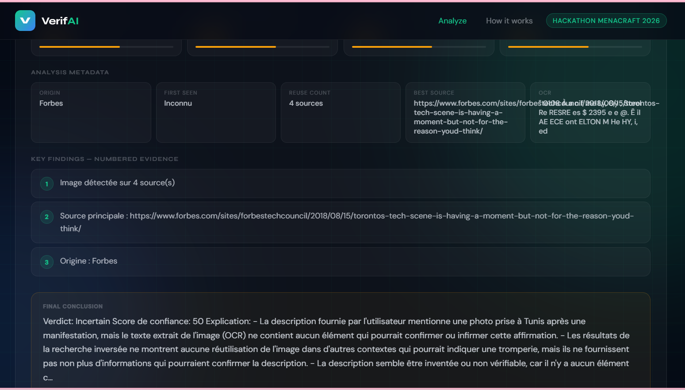

# VerifAI — AI-Powered Misinformation Detector ✅

**Résumé**  
VerifAI est un prototype full-stack pour la détection de désinformation en ligne basé sur l'analyse multimodale (image + texte), la recherche d'image inversée et le raisonnement par IA. Le backend orchestre des composants spécialisés (OCR, recherche inversée, analyse contextuelle, raisonnement IA) et expose une API FastAPI ; le frontend React fournit une UI pour la soumission de contenu et la visualisation des verdicts.

## Aperçu
- Langages : **Python (backend)**, **JavaScript/React (frontend)**
- IA : **Groq / LLaMA** (LLM pour le raisonnement)
- OCR : **Tesseract via pytesseract**
- Recherche inversée : **SerpAPI**
- Stockage : fichiers locaux pour images uploadées / temporaires

## 🏗️ Architecture
The diagram below shows the complete VerifAI AI pipeline from input to decision.


## 🎨 Design / Diagram

👉 View the system design on Canva:
https://canva.link/l3tggmem6je2srh

## Fonctionnalités
- **Extraction intelligente** : traitement d’image uploadée ou URL
- **OCR avancé** : extraction de texte depuis image via Tesseract
- **Recherche inversée** : traçabilité de l’origine de l’image via SerpAPI
- **Analyse de contexte** : détection d’incohérences temporelles et de signaux suspects
- **Raisonnement IA** : LLM pour verdict final (`Réel` / `Trompeur` / `Incertain`)
- **Score de confiance** : estimation de certitude sur 0-100
- **Explication structurée** : points d’incohérence et notes de raisonnement

## Pipeline de traitement
1. Soumission (URL ou image)
2. Téléchargement / enregistrement temporaire
3. OCR sur l’image
4. Recherche inversée via SerpAPI
5. Construction du contexte
6. Appel LLM
7. Application de règles de raisonnement
8. Génération du verdict final
9. Retour de la réponse structurée

## Flux principal de fonctionnement

### Analyse par URL
- L’utilisateur soumet une URL d’image ou d’article
- Le backend télécharge l’image et scrape éventuellement l’article
- OCR sur l’image si nécessaire
- Recherche inversée sur l’image
- LLM compare caption / OCR / sources
- Retourne verdict + explication

### Analyse par upload d’image
- L’utilisateur upload une image et un caption optionnel
- OCR extrait le texte
- Recherche inversée détecte les sources
- LLM analyse la cohérence
- Retourne verdict structuré

## Arborescence 
```
VerifAI/
├── README.md
├── requirements.txt
│
├── backend/
│   ├── main.py                      # Point d'entrée de l'application FastAPI
│   │
│   ├── api/
│   │   └── routes.py               # Routes / endpoints API
│   │
│   ├── core/
│   │   └── pipeline.py             # Orchestration du pipeline IA
│   │
│   ├── models/
│   │   └── schemas.py             # Schémas Pydantic (modèles de données)
│   │
│   ├── services/
│   │   ├── ocr.py                 # Extraction de texte (OCR)
│   │   ├── reverse_image.py       # Recherche d’image inversée
│   │   ├── url_service.py         # Analyse et traitement des URLs
│   │   ├── llm_service.py         # Appels aux modèles de langage
│   │   ├── reasoning_ai.py        # Raisonnement IA / analyse logique
│   │   ├── source_detector.py     # Détection et validation des sources
│   │   ├── post_service.py        # Traitement des posts (texte/image)
│   │   └── context_service.py     # Gestion du contexte global
│   │
│   ├── uploads/                   # Fichiers uploadés (images, etc.)
│   ├── test_ocr.png
│   ├── test_unit_ocr.py
│   ├── test_unit_context.py
│   └── venv/                      # Environnement virtuel (à ignorer Git)
│
├── frontend/
│   ├── package.json
│   ├── public/
│   │   └── index.html
│   │
│   └── src/
│       ├── App.js
│       ├── App.css
│       ├── index.js
│       ├── index.css
│       ├── App.test.js
│       ├── reportWebVitals.js
│       └── setupTests.js
└──docs
```
## 🔁 User Input Methods 
VerifAI supports two ways to analyze content: 
--- 
### 🖼️ 1. Image Upload 
Users can upload an image directly from their device.

 


This is a "real result" example


--- 
### 🌐 2. URL Input 
Users can paste a social media post URL (Twitter, Facebook, etc.). 



## Configuration

### Setup
```bash
Backend steup:
cd Backend
python -m venv venv
venv\Scripts\activate
pip install -r requirements.txt

Frontend setup:
bash
cd frontend
npm install

Lancement local
1) Démarrer le backend:
bash
cd Backend
uvicorn main:app --reload --port 8000
API disponible sur http://localhost:8000
Swagger UI: http://localhost:8000/docs

2) Démarrer le frontend:
bash
cd frontend
npm start
SPA disponible sur http://localhost:3000
